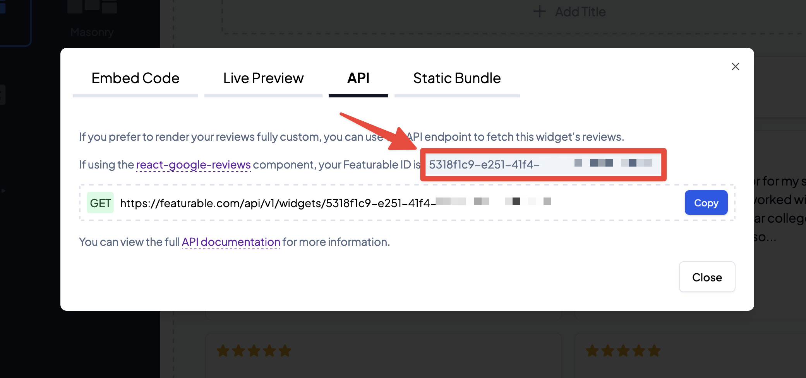
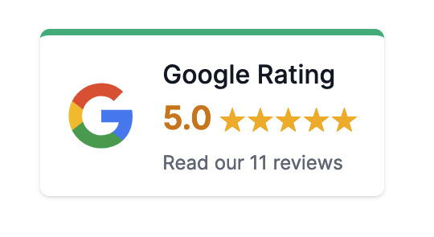
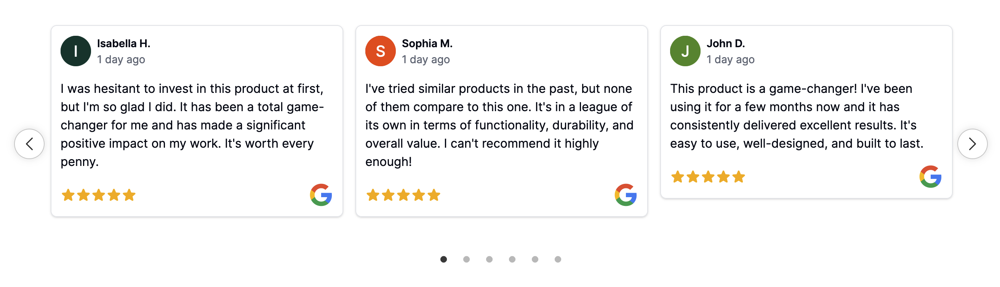

# React Google Reviews


<div align="center">
  <strong>Making adding Google reviews to any React app beautiful, easy, and free!</strong><br />
  <br />
  <a href="https://github.com/Featurable/react-google-reviews/issues/new?assignees=&labels=Type%3A+Bug&template=01_bug_report.yml&title=bug%3A+">Report a Bug</a>
  -
  <a href="https://github.com/Featurable/react-google-reviews/issues/new?assignees=&labels=Type%3A+Feature&template=02_feature_request.yml&title=feat%3A+">Request a Feature</a>
  -
  <a href="https://github.com/Featurable/react-google-reviews/issues/new?assignees=&labels=Type%3A+Question&template=03_support_question.yml&title=support%3A+">Ask a Question</a>
</div>

<div align="center">

<br />

[](https://www.npmjs.com/package/react-google-reviews)
[](https://github.com/Featurable/react-google-reviews/releases)
[](https://github.com/Featurable/react-google-reviews/releases/latest)
[](https://github.com/Featurable/react-google-reviews/blob/main/LICENSE)
[](https://github.com/Featurable/react-google-reviews/issues?q=is%3Aissue+is%3Aopen+label%3A%22help+wanted%22%2C%22Status%3A+Available%22+sort%3Aupdated-desc+)

</div>

---

<a href="https://github.com/premail">


</a><strong>This
React Google Reviews library is brought to you by
<a href="https://featurable.com">Featurable</a>, and the following
documentation can also be found at
<a href="https://featurable.com/docs/react-google-reviews">https://featurable.com/docs/react-google-reviews</a></strong>

---

**What is it?** React component to display Google reviews on your website. This library is built with React and uses the Google Places API -or- the free Featurable API to fetch and display Google reviews on your website.

Documentation and examples at [https://featurable.com/docs/react-google-reviews](https://featurable.com/docs/react-google-reviews). Source code at [https://github.com/Featurable/react-google-reviews](https://github.com/Featurable/react-google-reviews).

## Demo

Check out the [live demo](https://featurable.com/docs/react-google-reviews#live-demo) to see the React Google Reviews library in action.

## Features

1. **Customizable**: Choose from three layout options and customize the appearance of the reviews component
2. **SEO-friendly**: Include JSON-LD structured data for search engines to index your reviews
3. **Responsive**: Works on all devices and screen sizes
4. **Fast**: Caches reviews for quick loading and improved performance
5. **Free**: No cost to use the Featurable API for fetching reviews
6. **Fresh**: Automatically updates with new reviews from Google every 48 hours (using Featurable API)
7. **Accessible**: Built with accessibility in mind (WAI-ARIA compliant)
8. **Lightweight**: Small bundle size and minimal dependencies

## Installation

Install it from npm:

```
npm install react-google-reviews
```

## Usage

### Using the Featurable API (recommended)

Prerequisites:
1. Create a free Featurable account at [https://featurable.com](https://featurable.com)
2. Create a new Featurable widget
3. Click Embed > API and copy the widget ID

> [!NOTE]
> The Featurable API is free to use and provides additional features like caching, automatic updates, and more reviews. To prevent abuse, the Featurable API is subject to rate limits. 



```jsx
import { ReactGoogleReviews } from "react-google-reviews";
import "react-google-reviews/dist/index.css";

function Reviews() {
  // Create a free Featurable account at https://featurable.com
  // Then create a new Featurable widget and copy the widget ID
  const featurableWidgetId = "842ncdd8-0f40-438d-9c..."; // You can use "example" for testing

  return (
    <ReactGoogleReviews layout="carousel" featurableId={featurableWidgetId} />
  );
}
```

### Using the Google Places API (limited to 5 reviews)

Prerequisites:
1. Create a Google Cloud Platform account at [https://cloud.google.com](https://cloud.google.com)
2. Create a new project and enable the Google Places API **(old version)**
3. Find the Google Place ID using the [Place ID Finder](https://developers.google.com/maps/documentation/javascript/examples/places-placeid-finder)

```jsx
import { ReactGoogleReviews, dangerouslyFetchPlaceReviews } from "react-google-reviews";
import "react-google-reviews/dist/index.css";

/**
 * Example using NextJS server component
 */
async function ReviewsPage() {
  const placeId = "ChIJN1t_tDeuEmsRU..."; // Google Place ID
  const apiKey = "AIzaSyD..."; // Google API Key

  // IMPORTANT: Only fetch reviews server-side to avoid exposing API key
  const reviews = await dangerouslyFetchPlaceReviews(placeId, apiKey)

  return (
    // Carousel and other layouts require wrapping ReactGoogleReviews in a client component
    <ReactGoogleReviews layout="badge" reviews={reviews} />
  );
}

export default ReviewsPage;
```

> [!NOTE]
> The Google Places API **only returns the 5 most recent reviews.** If you need more reviews or want to customize which reviews are returned, consider using the [free Featurable API](https://featurable.com/).

## Configuration

### Layout

There are three layout options currently available:

1. **Badge**: Display a badge with the average rating, total reviews, and link to Google Business profile

```jsx
 <ReactGoogleReviews layout="badge" featurableId={featurableWidgetId} />
```



2. **Carousel**: An interactive carousel that displays reviews

```jsx
 <ReactGoogleReviews layout="carousel" featurableId={featurableWidgetId} />
```



3. **Custom renderer**: Render reviews using a custom function

```jsx
<ReactGoogleReviews layout="custom" featurableId={featurableWidgetId} renderer={(reviews) => {
  return (
    <div>
      {reviews.map(({ reviewId, reviewer, comment }) => (
        <div key={reviewId}>
          <h3>{reviewer.displayName}</h3>
          <p>{comment}</p>
        </div>
      ))}
    </div>
  );
}} />
```

The `reviews` prop is an array of `GoogleReview` objects with the following structure:

```
{
    reviewId: string | null;
    reviewer: {
        profilePhotoUrl: string;
        displayName: string;
        isAnonymous: boolean;
    };
    starRating: number;
    comment: string;
    createTime: string | null;
    updateTime: string | null;
    reviewReply?: {
        comment: string;
        updateTime: string;
    } | null;
};
```

### CSS Styling

For the carousel widget to work correctly, you must include the CSS file in your project:

```jsx
import "react-google-reviews/dist/index.css";
```

To override the default styles, you can use the CSS props to add custom styles:

```jsx
<style>
{`
.read-more {
  color: blue;
}
`}
</style>

<ReactGoogleReviews 
  layout="carousel"
  id="example"
  reviewReadMoreClassName="read-more"
  reviewReadMoreStyle={{ color: "blue" }}
/>
```

Please see the documentation for a list of CSS properties and examples of how to style the component.

[View CSS classes and examples](https://featurable.com/docs/react-google-reviews#css-classes)

## Props

### Common Props

| Prop | Type | Description |
| --- | --- | --- |
| featurableId | `string` | Featurable widget ID |
| reviews | [GoogleReview](#googlereview)[] | Array of reviews to display, fetched using `dangerouslyFetchPlaceReviews` |
| layout | `"badge" \| "carousel" \| "custom"` | Layout of the reviews component |
| nameDisplay?| `"fullNames" \| "firstAndLastInitials" \| "firstNamesOnly"` | How to display names on reviews |;
| logoVariant? | `"logo" \| "icon" \| "none"` | How to display the Google logo |
| maxCharacters? | `number` | When collapsed, the maximum number of characters to display in the review body |
| dateDisplay? | `"relative" \| "absolute"` | How to display the review date |
| reviewVariant? | `"card" \| "testimonial"` | Review layout variations |
| theme? | `"light" \| "dark"` | Color scheme of the component |
| structuredData? | `boolean` | Whether to include JSON-LD structured data for SEO |
| brandName? | `string` | Customize business name for structured data |
| productName? | `string` | Customize product name for structured data |
| productDescription? | `string` | Optional product description for structured data |
| accessibility? | `boolean` | Enable/disable accessibility features |
| hideEmptyReviews? | `boolean` | Hide reviews without text |
| disableTranslation? | `boolean` | Disables translation from Google to use original review text |
| totalReviewCount? | `number` | Total number of reviews on Google Business profile. This is automatically fetched if using `featurableId`. Otherwise, this is required if passing reviews manually and `structuredData` is true. |
| averageRating? | `number` | Average rating for Google Business profile. This is automatically fetched if using `featurableId`. Otherwise, this is required if passing reviews manually and `structuredData` is true. |
| errorMessage? | `React.ReactNode` | Custom error message to display if reviews cannot be fetched |

#### `GoogleReview` Model

| Prop | Type | Description |
| --- | --- | --- |
| reviewId | `string \| null` | Unique review ID |
| reviewer | `{ profilePhotoUrl: string; displayName: string; isAnonymous: boolean; }` | Reviewer information |
| starRating | `number` | Star rating (1-5) |
| comment | `string` | Review text |
| createTime | `string \| null` | Review creation time |
| updateTime | `string \| null` | Review update time |
| reviewReply? | `{ comment: string; updateTime: string; } \| null` | Review reply information |


### Carousel Props

| Prop | Type | Description |
| --- | --- | --- |
| carouselSpeed? | `number` | Autoplay speed of the carousel in milliseconds |
| carouselAutoplay? | `boolean` | Whether to autoplay the carousel |
| maxItems? | `number` | Maximum number of items to display at any one time in carousel |

### Badge Props

| Prop | Type | Description |
| --- | --- | --- |
| profileUrl? | `string` | Link to Google Business profile, if manually fetching reviews via Place API. Using Featurable API will automatically supply this URL. |

### Custom Layout Props

| Prop | Type | Description |
| --- | --- | --- |
| renderer? | (reviews: [GoogleReview](#googlereview)[]) => React.ReactNode | Custom rendering function |

## License

This project is licensed under the MIT License - see the [LICENSE](LICENSE) file for details. By using the Featurable API, you agree to the [Featurable Terms of Service](https://featurable.com/terms).

## Acknowledgements

This library uses [`slick-carousel`](https://github.com/kenwheeler/slick) and [`react-slick`](https://github.com/akiran/react-slick) for the carousel layout.

## Contributing

Contributions are what make the open-source community such an amazing place to learn, inspire, and create. Any contributions you make are **greatly appreciated**.

## Issues 

Please report any issues or bugs you encounter on the [GitHub Issues](https://github.com/Featurable/react-google-reviews/issues) page.